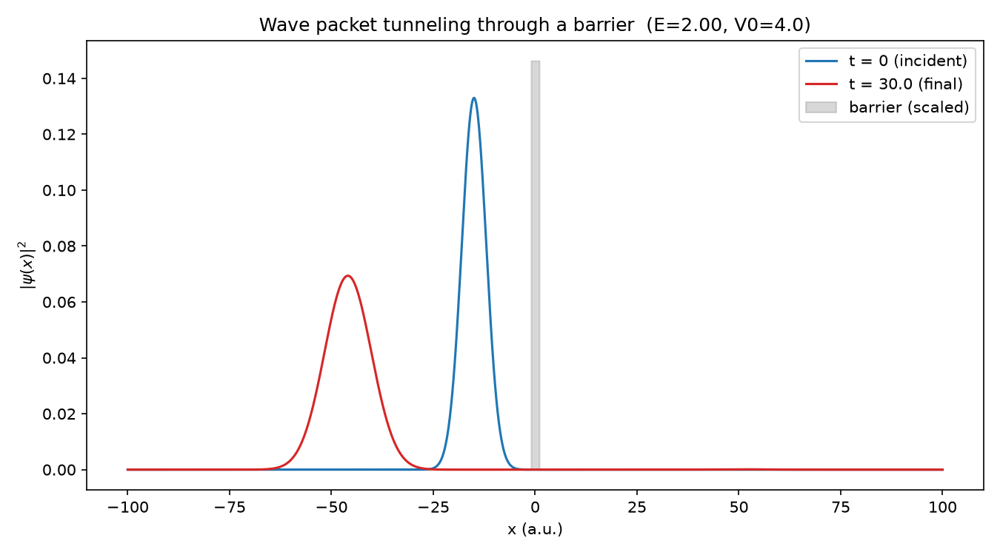
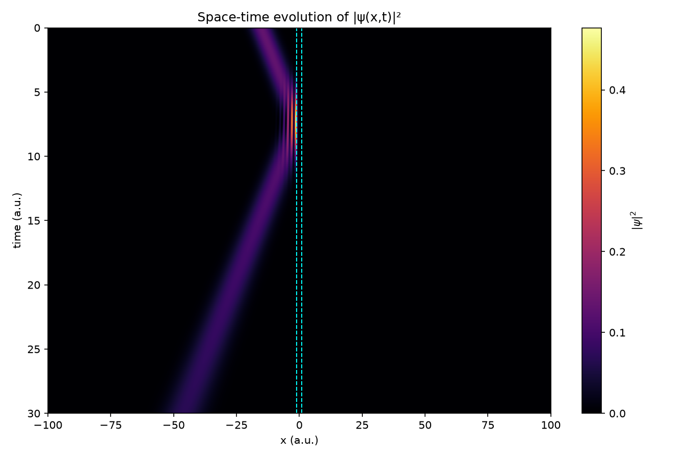
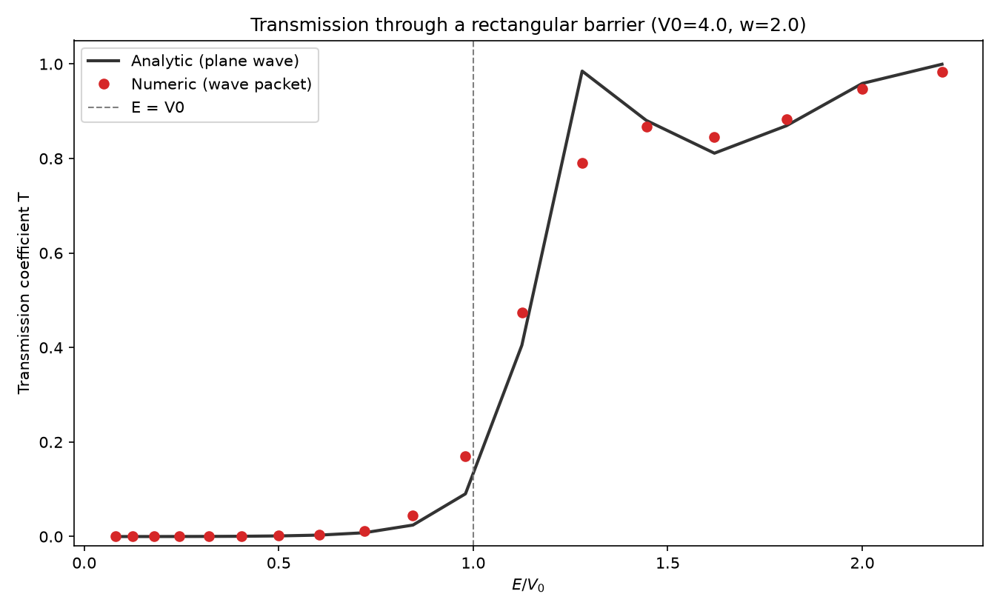

# Quantum Tunneling Simulator

A from-scratch numerical solver for the **time-dependent Schrödinger equation**,
simulating a Gaussian wave packet tunneling through a rectangular potential
barrier — validated against the exact analytic transmission formula.

## Physics

The 1D time-dependent Schrödinger equation (atomic units, ħ = m = 1):
is solved with the **Crank–Nicolson** finite-difference scheme:
This scheme is implicit, unconditionally stable, and — because the update
operator is unitary — conserves probability (‖ψ‖² = 1) to machine precision
at every time step. `H` is tridiagonal, so each step is solved efficiently
with `scipy.linalg.solve_banded` in O(N) time.

The initial state is a Gaussian wave packet with mean momentum `k0`
(mean energy `E = k0²/2`) incident on a rectangular barrier of height `V0`
and width `w`. After propagation, the transmission/reflection probabilities
are obtained by integrating `|ψ(x)|²` on each side of the barrier.

As a correctness check, the numeric result is compared against the
**exact analytic transmission coefficient** for a monochromatic plane wave
hitting the same barrier:

- Below the barrier (E < V0, classically forbidden — tunneling):
  `T = [1 + V0² sinh²(k₂w) / (4E(V0-E))]⁻¹`,  `k₂ = √(2(V0-E))`
- Above the barrier (E > V0 — transmission resonances):
  `T = [1 + V0² sin²(k₂w) / (4E(E-V0))]⁻¹`,  `k₂ = √(2(E-V0))`

## Results

**1. Wave packet before/after hitting the barrier** (E = 2.0, V0 = 4.0,
classically forbidden regime): most of the packet reflects, with a small
transmitted fraction tunneling through.

**2. Full space-time evolution** of the probability density, showing the
incident, reflected, and transmitted wave packets:

**3. Transmission coefficient vs. energy** — numeric wave-packet result vs.
the exact analytic plane-wave formula, swept across the barrier height:

The two curves agree closely (mean absolute error ≈ 0.025 across 18 energies
spanning E/V0 = 0.08–2.2). The numeric curve is a slightly smoothed version
of the analytic one near the resonance at E ≈ V0 — expected, since a real
wave packet has a spread of momenta/energies rather than a single sharp
energy, which washes out the narrow resonance predicted for a perfect plane
wave.

Numerical fidelity check: total probability is conserved to
`1.000000 → 1.000000` over the full run (Crank–Nicolson is exactly unitary).

## Project structure